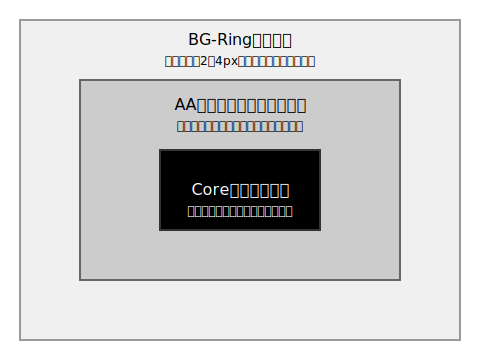
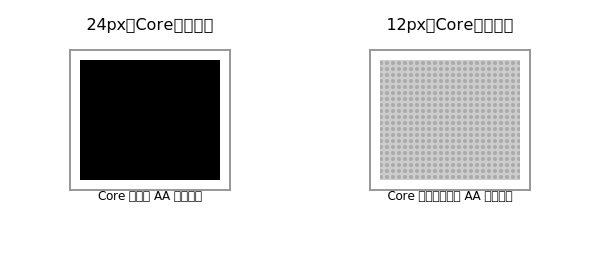
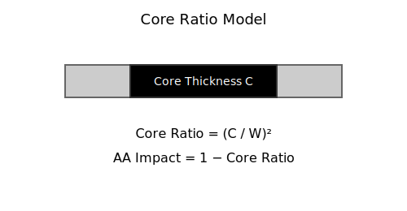
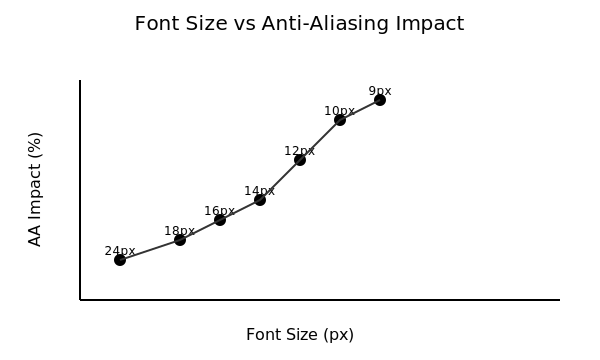
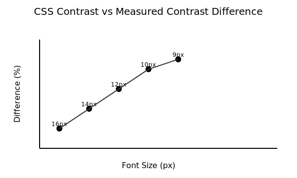
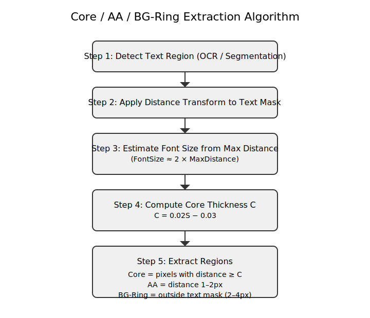

# wcag-aa-contrast

A technical proposal addressing anti-aliasing–induced contrast loss in WCAG evaluations.

---

## Overview

This repository contains the technical materials supporting a proposal submitted to the W3C WCAG Working Group.  
The proposal addresses a known but undocumented issue: anti‑aliasing significantly reduces measured contrast ratios, especially for small font sizes, even when CSS‑specified colors meet WCAG requirements.

The repository includes:

- A mathematical model (Core Ratio Model)  
- Empirical data across platforms  
- SVG figures illustrating rendering structure and contrast loss  
- An extraction algorithm for Core / AA / BG‑Ring regions  
- A complete technical document suitable for WCAG review  

---

## Motivation

WCAG 2.x defines contrast using intended colors, assuming uniform rendering.  
Modern rendering engines introduce anti‑aliasing that blends text and background colors, causing:

- Measured contrast to be 30–60% lower than theoretical contrast  
- False failures in automated accessibility tools  
- Inconsistent results across platforms and browsers  

This repository provides a reproducible framework to quantify and address this discrepancy.

---

## Contents

---

## Figures

### Figure 1 — Three-layer rendering model

### Figure 2 — Core shrinkage at small font sizes

### Figure 3 — Core Ratio model

### Figure 4 — Font size vs AA impact

### Figure 5 — CSS vs measured contrast difference

### Figure 6 — Extraction algorithm flowchart

---

## Core Concepts

### Three-layer Rendering Model
- **Core Region** — pure text color  
- **AA Band** — blended intermediate colors  
- **BG-Ring** — background sampling region  

### Core Ratio Model
A mathematical model representing the proportion of a glyph unaffected by anti-aliasing.

$$
\mathrm{CoreRatio} = \left( \frac{C}{W} \right)^2
$$
---

## Contrast Difference Thresholds

- **>25%** → measured contrast unreliable  
- **<15%** → measured contrast reliable  
- **15–25%** → warning range  

---

## WCAG Proposal

The full proposal submitted to the WCAG Working Group is available in:
[proposal.md](proposal.md)
---

## License

MIT License.  
Models, figures, and algorithms may be reused with attribution.

---

## Contact

For questions or discussion, please open an Issue.

